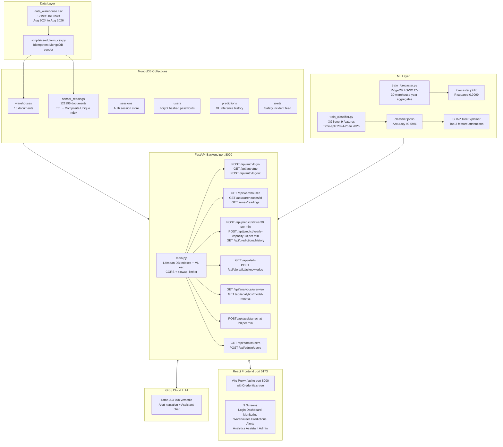
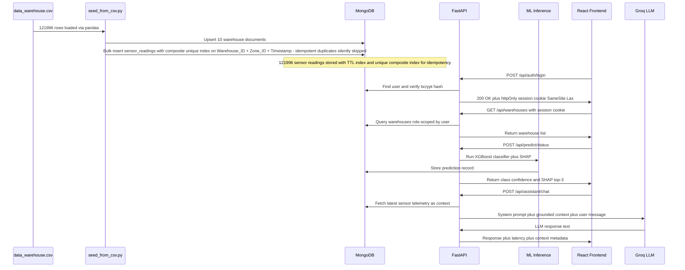
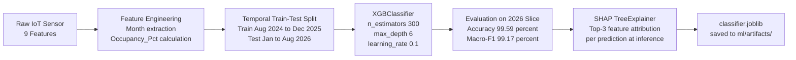
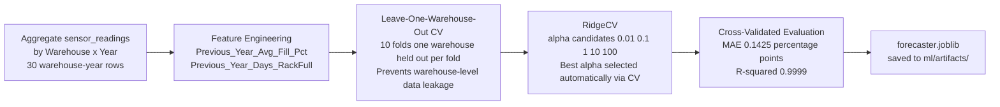
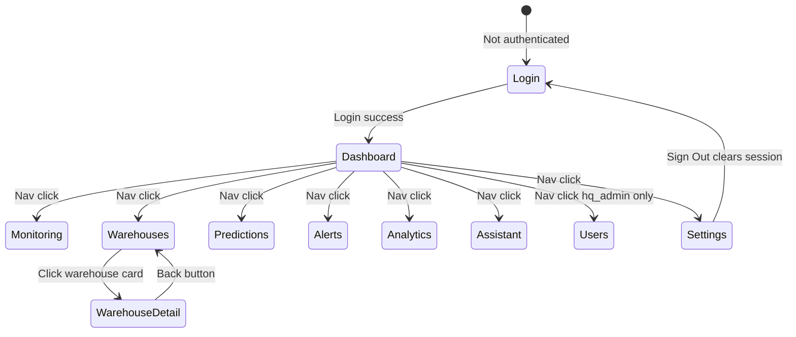
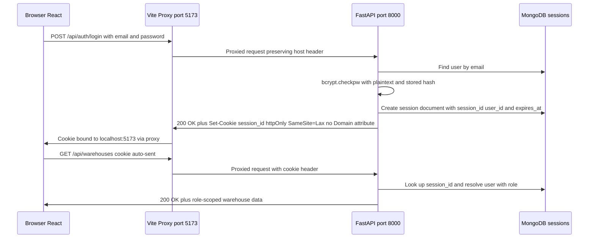

# 🏭 WareSense — AI-Powered Storage Monitoring & Control Center

> **A full-stack predictive control center for Tamil Nadu's 10-warehouse IoT network.**
> Transforms 122,000 raw sensor readings into real-time safety alerts, capacity forecasts, and grounded AI-driven operational intelligence — all served through a glassmorphism React dashboard.

### 🔑 Quick Demo Credentials

| Role | Government Email | Account Password | Access Level |
| :--- | :--- | :--- | :--- |
| **HQ Admin** | `admin@tnwarehouses.gov.in` | `admin123` | Full Network (10 Warehouses) |
| **Warehouse Head** | `head1@tnwarehouses.gov.in` | `head123` | Single Warehouse Scope |

---


## Table of Contents

- [Project Overview](#project-overview)
- [Tech Stack](#tech-stack)
- [System Architecture](#system-architecture)
- [Data Pipeline](#data-pipeline)
- [Machine Learning Models](#machine-learning-models)
- [API Reference](#api-reference)
- [Frontend Screens](#frontend-screens)
- [Authentication & Security](#authentication--security)
- [Directory Structure](#directory-structure)
- [Setup & Installation](#setup--installation)
- [Running the Application](#running-the-application)
- [ML Model Performance](#ml-model-performance)
- [Environment Variables](#environment-variables)
- [Design System](#design-system)

---

## Project Overview

The **Smart Warehouse CRM & Prediction Platform** is built for the **Tamil Nadu Civil Supplies Corporation (TNCSC)**, which operates a network of **10 central warehouses (godowns)** distributed across districts. Each warehouse has **4 IoT-instrumented storage zones**, continuously monitoring:

- Temperature & humidity (cold-chain safety)
- Smoke concentration (fire risk detection)
- Motion sensors (unauthorized access or activity detection)
- Sack count and rack fill levels (capacity management)

The platform ingests `data_warehouse.csv` — **121,996 IoT sensor rows spanning August 2024 to August 2026** — seeds them into MongoDB, trains two ML models, and exposes them via a FastAPI backend to a React 18 + Vite frontend with glassmorphism design.

### Core Capabilities

| Capability | Description |
|---|---|
| **Zone Status Classifier** | XGBoost model classifying each sensor reading into 6 safety states with 99.59% accuracy |
| **Capacity Forecaster** | RidgeCV regressor predicting yearly warehouse fill percentage, R² = 0.9999 |
| **SHAP Explainability** | Top-3 feature attributions for every classifier prediction using TreeExplainer |
| **Groq AI Assistant** | Conversational Q&A grounded in live MongoDB telemetry, powered by llama-3.3-70b-versatile |
| **Live Alert Feed** | Auto-generated safety incidents with Groq LLM narrative narration and acknowledge workflow |
| **Analytics Dashboard** | State-wide Tamil Nadu rollup with district-level occupancy breakdowns and model metrics |
| **Role-Scoped Auth** | Session-based auth: `hq_admin` (full network) and `warehouse_head` (single warehouse scope) |

---

## Tech Stack

### Backend

| Layer | Technology | Version |
|---|---|---|
| API Framework | FastAPI | 0.115.0 |
| ASGI Server | Uvicorn | 0.30.6 |
| Database Driver | Motor (async MongoDB) | 3.6.0 |
| Database | MongoDB | 6.0+ |
| Auth | bcrypt (direct, no passlib) | 4.2.0 |
| Rate Limiting | slowapi | 0.1.9 |
| ML Classifier | XGBoost | 2.1.1 |
| ML Forecaster | scikit-learn RidgeCV | 1.5.2 |
| Explainability | SHAP TreeExplainer | 0.46.0 |
| AI Assistant | Groq SDK (llama-3.3-70b-versatile) | 0.11.0 |
| Data Processing | pandas + numpy | 2.2.3 / 1.26.4 |

### Frontend

| Layer | Technology | Version |
|---|---|---|
| Build Tool | Vite | 8.x |
| UI Framework | React 18 + TypeScript | 18.x |
| State Management | Zustand | 5.x |
| HTTP Client | Axios (withCredentials) | 1.x |
| Charts | Recharts | 2.x |
| Icons | Lucide React | Latest |
| Styling | Vanilla CSS (glassmorphism design system) | — |

---

## System Architecture



---

## Data Pipeline

### End-to-End Data Flow



### Dataset Schema

| Column | Type | Description |
|---|---|---|
| `Warehouse_ID` | int | 1–10, maps to a physical godown |
| `Zone_ID` | int | 1–4 zones per warehouse |
| `Timestamp` | datetime | Hourly sensor reading timestamp |
| `Temperature_C` | float | Zone temperature in Celsius |
| `Humidity_%` | float | Relative humidity percentage |
| `Smoke_ppm` | float | Smoke concentration in PPM |
| `Motion` | bool | 1 = motion detected in zone |
| `Distance_cm` | float | Proximity sensor reading |
| `Number_of_Sacks` | int | Current sack count |
| `Zone_Capacity_Sacks` | int | Maximum sack capacity |
| `Occupancy_Pct` | float | Number_of_Sacks divided by Zone_Capacity_Sacks times 100 |
| `Warehouse_Status` | str | Target label: Safe / High Temp / Critical / Fire Risk - Critical / Motion Detected / Rack Full |

---

## Machine Learning Models

### Model 1 — Zone Status Classifier (XGBoost)



**Input Features (9):**
`Distance_cm` | `Temperature_C` | `Humidity_%` | `Smoke_ppm` | `Motion` | `Number_of_Sacks` | `Zone_Capacity_Sacks` | `Occupancy_Pct` | `Month`

**Output Classes (6):**

| Class | Description |
|---|---|
| `Safe` | All sensors within normal thresholds |
| `High Temp` | Temperature exceeds safe band |
| `Critical` | Multiple sensors in danger zone |
| `Fire Risk - Critical` | Smoke + high temp combination |
| `Motion Detected` | Unauthorized zone activity |
| `Rack Full` | Occupancy at or near 100% |

**Per-Class Performance:**

| Class | Precision | Recall | F1 |
|---|---|---|---|
| Safe | 99.97% | 99.54% | 99.76% |
| High Temp | 98.33% | 99.93% | 99.12% |
| Motion Detected | 99.62% | 99.74% | 99.68% |
| Rack Full | 100.00% | 99.50% | 99.75% |
| Critical | 98.88% | 98.53% | 98.71% |
| Fire Risk - Critical | 99.19% | 96.85% | 98.01% |

**Top Feature Importances (SHAP):**
1. `Motion` — 44.69%
2. `Distance_cm` — 22.10%
3. `Temperature_C` — 17.84%

---

### Model 2 — Yearly Capacity Forecaster (RidgeCV)



**Engineered Features:**
- `Previous_Year_Avg_Fill_Pct` — Warehouse-level average occupancy from prior year
- `Previous_Year_Days_RackFull` — Number of days the warehouse hit 100% fill the prior year

**Output:** Predicted yearly occupancy fill percentage for target warehouse-year.

> **Indicative Note:** Trained on 30 warehouse-year aggregates (10 warehouses x 3 years). Strong fit metrics are partly a function of small sample size. Use as directional planning guidance, not as a statistically robust absolute forecast.

---

## API Reference

### Authentication

| Method | Endpoint | Description | Auth |
|---|---|---|---|
| POST | `/api/auth/login` | Login — sets httpOnly session cookie | Public |
| GET | `/api/auth/me` | Returns current authenticated user | Session |
| POST | `/api/auth/logout` | Deletes session and clears cookie | Session |

### Warehouse & Telemetry

| Method | Endpoint | Description | Role |
|---|---|---|---|
| GET | `/api/warehouses` | List warehouses — role-scoped | Session |
| GET | `/api/warehouses/{id}` | Single warehouse with zone metadata | Session |
| GET | `/api/warehouses/{id}/zones/{zone_id}/readings` | Paginated sensor readings | Session |

### ML Predictions

| Method | Endpoint | Rate Limit | Description |
|---|---|---|---|
| POST | `/api/predict/status` | 30/min | XGBoost classifier + SHAP |
| POST | `/api/predict/yearly-capacity` | 10/min | RidgeCV capacity forecaster |
| GET | `/api/predictions/history` | — | Past prediction records |

### Alerts, Analytics, Assistant, Admin

| Method | Endpoint | Description |
|---|---|---|
| GET | `/api/alerts` | Safety alert feed with Groq narration |
| POST | `/api/alerts/{id}/acknowledge` | Acknowledge an active alert |
| GET | `/api/analytics/overview` | TN state-wide rollup (capacity, occupancy, status) |
| GET | `/api/analytics/model-metrics` | Serve metrics.json |
| POST | `/api/assistant/chat` | Grounded LLM Q&A — 20/min |
| GET | `/api/admin/users` | List users (hq_admin only) |
| POST | `/api/admin/users` | Create user (hq_admin only) |

---

## Frontend Screens



| Screen | Description |
|---|---|
| **Login** | Glassmorphism auth card with quick-fill demo buttons |
| **Dashboard** | TN state-wide KPI cards, district SVG map, live status distribution |
| **Monitoring** | Real-time zone telemetry cards, Recharts line and bar sensor charts |
| **Warehouses** | 10-godown grid with zone badges, occupancy, and latest status |
| **Warehouse Detail** | Per-zone selector and paginated sensor reading table |
| **Predictions** | Model 1 classifier with SHAP attribution UI, Model 2 capacity slider |
| **Alerts** | Safety alert feed with Groq LLM narration and acknowledge button |
| **Analytics** | Feature importances chart and model performance metrics cards |
| **AI Assistant** | Grounded conversational chat with live MongoDB telemetry sidebar |
| **Users** | HQ Admin user management and creation panel |
| **Settings** | User profile, theme toggle, and sign-out |

---

## Authentication & Security

### Session Cookie Flow



### Role-Based Access Control

| Role | Warehouse Access | User Management |
|---|---|---|
| `hq_admin` | All 10 Tamil Nadu warehouses | Full CRUD via /api/admin/users |
| `warehouse_head` | Single assigned warehouse only | None — 403 on other warehouses |

### Security Measures

- Passwords hashed with **bcrypt** cost factor 12 — no passlib wrapper
- Sessions stored in MongoDB with TTL expiry — no server-side memory
- httpOnly cookie with `SameSite=Lax` — no `Domain=` attribute (avoids localhost:5173 cookie binding conflicts with Vite proxy)
- API rate limiting via **slowapi**: 30/min classifier, 10/min forecaster, 20/min assistant
- CORS restricted to `http://localhost:5173` in development

---

## Directory Structure

```
Code/
├── README.md                           # This file
├── Dataset/
│   └── data_warehouse.csv              # 121,996 IoT sensor rows (Aug 2024 - Aug 2026)
│
├── backend/
│   ├── main.py                         # FastAPI entrypoint - lifespan CORS slowapi
│   ├── requirements.txt                # Pinned Python dependencies
│   ├── .env                            # Secret config (not committed)
│   ├── .env.example                    # Environment variable template
│   │
│   ├── core/
│   │   ├── config.py                   # Pydantic Settings - loads .env
│   │   ├── security.py                 # bcrypt hash and verify helpers
│   │   └── limiter.py                  # Shared slowapi Limiter instance
│   │
│   ├── db/
│   │   └── mongo.py                    # Motor async client + TTL and unique index initializer
│   │
│   ├── models/
│   │   ├── auth.py                     # User and Session Pydantic models
│   │   ├── warehouse.py                # Warehouse Zone and SensorReading models
│   │   ├── prediction.py               # PredictionRequest and Response models
│   │   ├── alert.py                    # Alert model
│   │   └── assistant.py                # ChatMessage and ChatResponse models
│   │
│   ├── routers/
│   │   ├── auth.py                     # /api/auth/* endpoints
│   │   ├── warehouses.py               # /api/warehouses/* endpoints
│   │   ├── predictions.py              # /api/predict/* endpoints with rate limiting
│   │   ├── alerts.py                   # /api/alerts/* endpoints with Groq narration
│   │   ├── analytics.py                # /api/analytics/* endpoints
│   │   ├── assistant.py                # /api/assistant/* endpoints with Groq chat
│   │   └── admin.py                    # /api/admin/* endpoints hq_admin only
│   │
│   ├── ml/
│   │   ├── train_classifier.py         # XGBoost training pipeline with temporal split
│   │   ├── train_forecaster.py         # RidgeCV training with LOWO cross-validation
│   │   ├── inference.py                # Model loading and SHAP inference at runtime
│   │   └── artifacts/
│   │       ├── classifier.joblib       # Trained XGBoost model ~720 KB
│   │       ├── forecaster.joblib       # Trained RidgeCV model ~1.3 KB
│   │       └── metrics.json            # Saved model evaluation metrics and class breakdown
│   │
│   └── scripts/
│       ├── seed_from_csv.py            # Idempotent MongoDB CSV seeder with duplicate skip
│       └── create_admin.py             # Seeds hq_admin and warehouse_head users
│
└── frontend/
    ├── vite.config.ts                  # /api proxy to port 8000
    ├── package.json
    ├── tsconfig.json
    │
    └── src/
        ├── main.tsx                    # React DOM entrypoint
        ├── App.tsx                     # Router + auth guard + theme class
        ├── index.css                   # Design system tokens Light/Dark + glassmorphism
        │
        ├── api/
        │   └── client.ts               # Axios instance with withCredentials true
        │
        ├── stores/
        │   ├── authStore.ts            # Zustand auth state with checkAuth on mount
        │   └── themeStore.ts           # Zustand theme state with localStorage persistence
        │
        ├── types/
        │   └── index.ts                # TypeScript interfaces for all API entities
        │
        ├── components/
        │   ├── GlassCard.tsx           # Reusable glassmorphism card container
        │   ├── LeftPanel.tsx           # Collapsible nav rail 72px collapsed 260px expanded
        │   └── StatusBadge.tsx         # Color-coded status pill for zone states
        │
        └── pages/
            ├── Login.tsx               # Auth page with demo quick-fill shortcuts
            ├── Dashboard.tsx           # State-wide KPI overview and district map
            ├── Monitoring.tsx          # Live sensor telemetry cards and Recharts trends
            ├── Warehouses.tsx          # 10-godown grid with zone and status badges
            ├── WarehouseDetail.tsx     # Per-zone selector and sensor reading table
            ├── Predictions.tsx         # ML inference UI with SHAP and capacity slider
            ├── Alerts.tsx              # Safety incident feed with Groq narration
            ├── Analytics.tsx           # Model metrics and feature importances
            ├── Assistant.tsx           # Groq-backed conversational AI with telemetry context
            ├── Settings.tsx            # User profile theme toggle and sign-out
            └── admin/
                └── Users.tsx           # HQ Admin user management panel
```

---

## Setup & Installation

### Prerequisites

| Tool | Required Version |
|---|---|
| Python | 3.10+ |
| Node.js | 18+ |
| npm | 9+ |
| MongoDB | 6.0+ running as a service |

### 1. Backend Setup

```bash
cd backend

# Create and activate Python virtual environment (Windows PowerShell)
python -m venv .venv
.\.venv\Scripts\Activate.ps1

# Install all pinned dependencies
pip install -r requirements.txt
```

### 2. Configure Environment

```bash
# Copy the template
copy .env.example .env
```

Edit `.env` with your credentials:

```env
MONGO_URI=mongodb://localhost:27017
SESSION_SECRET=your-random-64-character-secret-string-here
GROQ_API_KEY=your-groq-api-key-from-console.groq.com
GROQ_MODEL=llama-3.3-70b-versatile
```

### 3. Seed the Database

```bash
# Seeds 10 warehouses + 121,996 sensor readings into MongoDB
# Idempotent - safe to re-run, duplicates are skipped automatically
python scripts/seed_from_csv.py

# Seeds hq_admin and warehouse_head demo users
python scripts/create_admin.py
```

### 4. Train ML Models

```bash
# Train XGBoost zone status classifier
python ml/train_classifier.py

# Train RidgeCV yearly capacity forecaster
python ml/train_forecaster.py
```

Trained artifacts are saved to `ml/artifacts/`.

### 5. Frontend Setup

```bash
cd ../frontend
npm install
```

---

## Running the Application

### Start Backend (Terminal 1)

```bash
cd backend
.\.venv\Scripts\Activate.ps1
.\.venv\Scripts\python -m uvicorn main:app --host 127.0.0.1 --port 8000
```

- FastAPI: `http://127.0.0.1:8000`
- Interactive API docs: `http://127.0.0.1:8000/docs`

### Start Frontend (Terminal 2)

```bash
cd frontend
npm run dev
```

- React app: `http://localhost:5173`

### Demo Login Credentials

| Role | Email | Password | Access |
|---|---|---|---|
| HQ Admin | `admin@tnwarehouses.gov.in` | `admin123` | All 10 warehouses + Admin panel |
| Warehouse Head | `head1@tnwarehouses.gov.in` | `head123` | Warehouse #1 only |

---

## ML Model Performance

### Overall Summary

| Metric | Classifier (XGBoost) | Forecaster (RidgeCV) |
|---|---|---|
| **Accuracy** | **99.59%** | — |
| **Macro F1** | **99.17%** | — |
| **MAE** | — | **0.1425 pp** |
| **R-squared** | — | **0.9999** |
| Training Data | Aug 2024 – Dec 2025 readings | Warehouse-year aggregates |
| Test / Validation | Jan – Aug 2026 readings | Leave-One-Warehouse-Out CV |
| SMOTE Applied | No — dataset already balanced | N/A |
| Last Trained | 2026-08-27 | 2026-08-27 |

### Per-Class Classifier Results

| Class | Precision | Recall | F1-Score |
|---|---|---|---|
| Safe | 99.97% | 99.54% | 99.76% |
| High Temp | 98.33% | 99.93% | 99.12% |
| Motion Detected | 99.62% | 99.74% | 99.68% |
| Rack Full | 100.00% | 99.50% | 99.75% |
| Critical | 98.88% | 98.53% | 98.71% |
| Fire Risk - Critical | 99.19% | 96.85% | 98.01% |

### Forecaster Model Formula

```
Predicted_Fill_Pct = 1.0157 * Previous_Year_Avg_Fill_Pct
                   + 0.0108 * Previous_Year_Days_RackFull
                   - 0.6463
```

---

## Environment Variables

| Variable | Required | Default | Description |
|---|---|---|---|
| `MONGO_URI` | Yes | — | MongoDB connection string |
| `SESSION_SECRET` | Yes | — | Random 64-character string for session HMAC security |
| `GROQ_API_KEY` | Yes | — | API key from console.groq.com |
| `GROQ_MODEL` | Yes | `llama-3.3-70b-versatile` | Groq model identifier |

---

## Design System

The frontend uses a custom glassmorphism design system defined in `src/index.css`.

### Color Tokens

| Token | Light Mode | Dark Mode | Usage |
|---|---|---|---|
| `--bg-primary` | `#FFF6EE` | `#0D1B2A` | Page background |
| `--bg-glass` | `rgba(255,255,255,0.6)` | `rgba(13,27,42,0.6)` | Card glass layer |
| `--brand-primary` | `#219EBC` | `#68CFDD` | Primary CTA actions |
| `--brand-accent` | `#FFB703` | `#FFB703` | Highlights and badges |
| `--brand-danger` | `#FB8500` | `#FB8500` | Alerts and danger states |
| `--text-strong` | `#023047` | `#E8F4F8` | Headings and key labels |

### Glassmorphism Card Properties

```css
.glass-panel {
  background: var(--bg-glass);
  backdrop-filter: blur(16px);
  -webkit-backdrop-filter: blur(16px);
  border: 1px solid rgba(255, 255, 255, 0.15);
  border-radius: 16px;
  box-shadow: 0 4px 24px rgba(0, 0, 0, 0.08);
}
```

---

*Built using FastAPI, React 18, XGBoost, SHAP, and Groq LLaMA 3.3 for the TNCSC warehouse management modernization initiative.*
